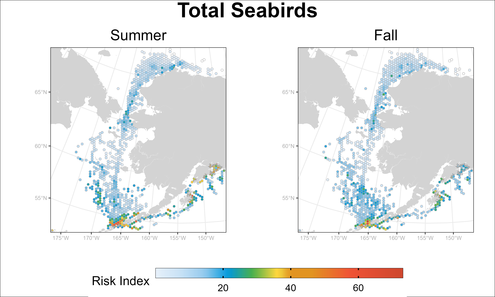

# Seabird-Vessel Traffic Risk Analysis

## Overview

The **Seabird-Vessel Traffic** repository contains R scripts for evaluating the seasonal risk of interactions between seabirds and vessel traffic in the north Pacific and Pacific Arctic. This project aims to provide insights into potential conflicts between seabird populations and maritime activities, helping in the identification of high-risk areas and times. The scripts analyze data and generate visualizations to facilitate informed decision-making and conservation efforts.

## Table of Contents

1. [Introduction](#introduction)
2. [Requirements](#requirements)
3. [Installation](#installation)
4. [Usage](#usage)
5. [Data](#data)
6. [Project Organization](#project-organization)
7. [Results](#results)
8. [Authors](#authors)

## Introduction

Climate change and anthropogenic activities are directly and indirectly altering patterns of human-nature interactions around the world. Alaska is host to nearly 40 million seabirds that nest along the coast and another 40 million birds that migrate annually to feed in its productive waters during northern summers. Concurrently, a variety of marine vessel activities occur in Alaska’s waters, including fishing and transportation of resources and cargo. Regions such as the Gulf of Alaska and Aleutian Islands have experienced high levels of vessel traffic for decades but, others, such as the Bering Strait, have only recently become accessible, due to the loss of sea ice). These patterns of seabird distribution and vessel traffic create a complex landscape of risk to seabirds, due to exposure to artificial light from ships and other potential impacts such as oil spills. interference with seabird navigation Here, we use vessel traffic data (AIS) and seabird distribution (NPPSD) to analyze current overlap between vessels and at-sea seabird distributions during summer (June-August) and fall (September-November). We examine broadscale patterns of risk for seabird taxa known to be susceptible to vessel collisions for all Alaskan marine waters and for three regions. , , and then dive deeper to look into the landscape of risk at regional scales for species susceptible to vessel collisions, including species of conservation concern. Results will help identify regional, seasonal, and taxa-specific distributions of risk which can guide spatial management measures designed to reduce risk and injury to seabirds from vessel activities.

## Requirements

This project was created using the following software:

* R (version 4.3.0)
* RStudio (optional but recommended)
* Required R packages: 
  - targets (1.2.0)
  - tarchetypes (0.7.7)
  - tidyverse (2.0.0)
  - sf (1.0-13)
  - ggpubr (0.6.0)
  - metR (0.14.0)

## Installation 

So long as you have git installed on your computer, generating a copy of this repository on your personal computer is as simple as typing `git clone https://github.com/kellykapsar/SeabirdVesselTraffic` in your terminal. See [this site](https://git-scm.com/book/en/v2/Git-Basics-Getting-a-Git-Repository) for a tutorial if you are unfamiliar with this process.  

## Usage

This project is run using an automated workflow using the [Targets](https://books.ropensci.org/targets/) package. The Targets package is a Make-like tool that generates a workflow pipeline for a given analysis. Each step in the analysis is saved in the form of a `tar_target`. Behind the scenes, the package keeps track of the inputs and outputs of each `tar_target` and increases the speed and efficiency of data analysis by only rerunning targets when you make a change to an upstream portion of the script.  

So long as you have all the proper data inputs (see [Data section](#data) below), running the entire analysis requires only typing `tar_make()` into your R console.  

## Data

**Inputs:**  
- `Locations_NPPSDv4.csv`: Location information regarding transect locations. From the [North Pacific Pelagic Seabird Database, v.4](https://www.usgs.gov/centers/alaska-science-center/science/north-pacific-pelagic-seabird-database).  
- `Observations_NPPSDv4.csv`: Seabird observation information. From the [North Pacific Pelagic Seabird Database, v.4](https://www.usgs.gov/centers/alaska-science-center/science/north-pacific-pelagic-seabird-database).  
- `NPPSD_Bird_Codes_Only_Revised.csv`: Author-created spreadsheet desginating taxonomic groupings for analysis.  
- `traffic_clean.csv`: Total hours of vessel traffic (night, day, and all) by hex_id. Available upon request from authors.  
- `hex_x_ocean.shp`: Hex grid for study area with unique hex_ids.  
- `AK_CAN_RUS.shp`: Basemap used for plots.  

## Project Organization

```
_targets.R                  Master file for targets pipeline which automates the analysis workflow. 
R/
  1_prep_data.R             Clean seabird and vessel traffic data and spatially intersect with hex objects.  
  2_calculate_risk.R        Calculate categorical and continuous risk by season and taxa.
  3a_plot_results.R         Create plots of seabird density, vessel activity, and risk. 
  3b_results_tables.R       Create summary tables of seabird density, vessel activity, and risk statistics. 


```

## Results

Outputs from this analysis include:  
* Continuous risk maps for summer and fall for each taxa group and region.  
* Categorical risk maps for summer and fall for each taxa group and region.  
* Seabird density maps for summer and fall for each taxa group and region.  
* Vessel activity risk maps for summer and fall for each region.  
  
Example of continuous risk map:  
  

## Authors

This project was developed by:  
* [Kelly Kapsar](kellykapsar.netlify.app) (Michigan State University)  
* [Ben Sullender](https://www.kickstepapproaches.com/) (Kickstep Approaches)  
* [Kathy Kuletz](https://www.linkedin.com/in/kathy-kuletz-5a983793) (USFWS). 

---

*README file was created with assistance from chatGPT.*
